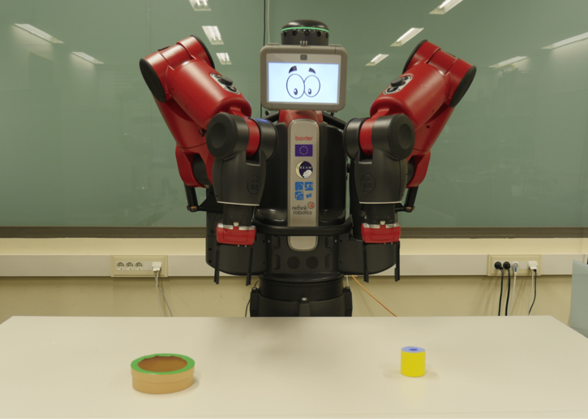

# Default experiment

This experiment uses a Discrete Event Simulator that simulates, without physics, the Baxter robot, which has two arms.



In this experiment is tested the behavior of the Long-Term Memory (LTM), without any motivational system. There are no Needs and Drives, and the Policies, Goal, and World Model are defined in the beginning. The objective is to create the corresponding P-Nodes and C-Nodes, which allow the simulated robot to achieve the Goal effectively, choosing the correct Policy in each situation.

The World Model node, called GripperAndLowFriction, defines the behavior of the simulator, but it hasn't effect on the operation of the cognitive architecture, because it 
acts as a dummy node that always has 1.0 activation. That is, changing the WorldModel affects the behavior of the simulated environment and, therefore, the effect of the policies in it, but without a direct influence on the cognitive architecture.

The Goal node, called ObjectInBoxStandalone, consists on introducing a cylinder into a box correctly. It can give several values of reward: 0.2 if the policy executed slightly approached the robot to the final objective; 0.3 or 0.6 if the robot approached to it more closely; or 1.0 if the robot reached the objective. This node, as the World Mode, has always 1.0 activation.

The Policy nodes that the robot can use are the following ones:

- **Grasp object:** Use one of the two grippers to grasp an object
- **Grasp object with two hands:** Use both arms to grasp an object between their ends
- **Change hands:** Move an object from one gripper to the other 
- **Sweep object:** Sweep an object to the central line of the table
- **Ask nicely:** Ask experimenter, simulated in this case, to bring something to within reach
- **Put object with robot:** Deposit an object close to the robot base
- **Put object in box:** Place an object in a receptacle
- **Throw:** Throw an object to a position

A P-Node and C-Node pair is created each time a reward is obtained. Thus, at the end of the experiment, seven pairs should be created, one per Policy, except *Put object with robot*, which doesn't lead to any reward.

We will have this structure for each Policy:


So, as we can see, the Policies activation depends exclusively on their P-Nodes activation. Thus, during the experiment, points and anti-point will be added to the P-Nodes each time a Policy is executed, improving the calculation of activations and, in consequence, the decision-making of the cognitive architecture.

You can find more conceptual information about the e-MDB architecture in the 5.1 Deliverable of the WP5 of the PILLAR Robots project.

## Installation

To install this experiment, it's necessary to create a ROS workspace and clone the following GitHub meta repository:

[wp5_gii meta repository](https://github.com/pillar-robots/wp5_gii)

```bash
mkdir -p ~/eMDB_ws/src

cd ~/eMDB_ws/src

git clone --recursive https://github.com/pillar-robots/wp5_gii.git
```

The next step is to compile the ROS workspace:

```bash
colcon build --symlink-install
```

```{note}
Remember to install the dependencies!

- ROS 2 Humble
- Numpy 1.24.3
- Sklearn 1.4.2
- Tensorflow 2.15.0
- Yamlloader 1.3.2

*Other versions could work, but the indicated ones have proven to be functional.*
```

## Execution

To execute the experiment or another launch file, it's essential to source the ROS workspace:

```bash
source install/setup.bash
```

Afterwards, the experiment can be launched:

```bash
ros2 launch experiments example_launch.py
```

Once executed, it is possible to see the logs in the terminal, being able to follow the behavior of the experiment in real time.

## Results

Executing the example experiment, it will create two files by default: **goodness.txt** and **pnodes_success.txt**.

In the first one, it is possible to observe important information, such as the policy executed and the reward obtained per iteration. It is possible to observe the learning process by seeing this file in real time with the following command:

```bash
tail -f goodness.txt
```

| Iteration | Goal                     | World                     | Reward | Policy                | Sensorial changes | C-nodes |
|-----------|--------------------------|---------------------------|--------|-----------------------|-------------------|---------|
| 1416      | object_in_box_standalone | GRIPPER_AND_LOW_FRICTION  | 0.3    | sweep_object          | True              | 7       |
| 1417      | object_in_box_standalone | GRIPPER_AND_LOW_FRICTION  | 0.6    | grasp_with_two_hands  | True              | 7       |
| 1418      | object_in_box_standalone | GRIPPER_AND_LOW_FRICTION  | 1.0    | put_object_in_box     | True              | 7       |

In the second file, it's possible to see an activation historical of the P-Nodes and if it was a point (True) or an anti-point (False).

When the execution is finished, it's possible to obtain statistics about reward and P-Nodes activations per 100 iterations by using the scripts available in the scripts directory of the core package (~/eMDB_ws/src/wp5_gii/emdb_core/core/scripts):

```bash
python3 ~/eMDB_ws/src/wp5_gii/emdb_core/core/scripts/generate_grouped_statistics -n 100 -f goodness.txt > goodness_grouped_statistics.csv

python3 ~/eMDB_ws/src/wp5_gii/emdb_core/core/scripts/generate_grouped_success_statistics -n 100 -f pnodes_success.txt > pnodes_grouped_statistics.csv
```

```{note}
To use these scripts it's necessary to have installed **python-magic 0.4.27** dependency.
```

By plotting the data of these final files, it is possible to obtain a visual interpretation of the learning of the cognitive architecture. 


