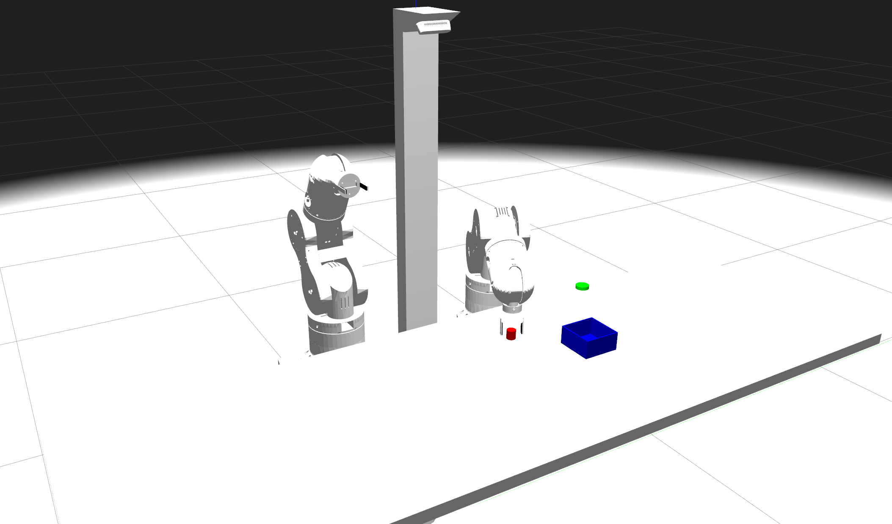
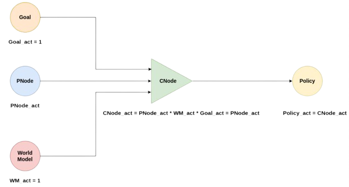

# OSCAR Experiment

This experiment is the [PutObjectInBox experiment](put_object_in_box_experiment.md) implemented in the OSCAR robot in the Gazebo simulator. 

Remembering, the task consists in placing a cylinder in a box. These elements are placed in random positions and may be out of reach of the robot.

<div style="width:100%; margin:auto; text-align:center;">



*OSCAR robot*
</div>

## Experiment description

As in the PutObjectInBox experiment, this experiment tests the behavior of the Long-Term Memory (LTM) of the architecture. There is a single World Model (GripperAndLowFriction), and no Desires (Needs & Missions) nor Drives are used.

The perceptions received by the cognitive architecture are the following ones:

- **Boxes**: data about the boxes in the table.
    - **Distance**: distance from the robot to the box.
    - **Angle**: angle from the robot to the box.
    - **Diameter**: diameter of the box.

- **Cylinders**: data about the cylinders in the table.
    - **Distance**: distance from the robot to the cylinder.
    - **Angle**: angle from the robot to the cylinder.
    - **Diameter**: diameter of the cylinder.
- **Ball in left hand**: indicates if the robot has the cylinder in the left gripper.
- **Ball in right hand**: indicates if the robot has the cylinder in the right gripper.

The policies that the robot can use to solve the task are the following ones:

- **Grasp object:** Use one of the two grippers to grasp an object.
- **Grasp object with two hands:** Use both arms to grasp an object between their ends.
- **Change hands:** Move an object from one gripper to the other.
- **Sweep object:** Sweep an object to the central line of the table.
- **Ask nicely:** Ask experimenter, simulated in this case, to bring something to within reach.
- **Put object with robot:** Deposit an object close to the robot base.
- **Put object in box:** Place an object in a receptacle.
- **Throw:** Throw an object to a position.

The goal node ObjectInBoxStandalone provides reward for placing the cylinder inside the box. Partial rewards are given as the robot nears the final objective: 0.25 for approaching the cylinder with the button, 0.5 for grasping the cylinder, 0.75 for changing the cylinder to the appropriate hand and 1.0 for placing the cylinder in the box.    

A P-Node and C-Node pair is created each time a reward is obtained. Thus, at the end of the experiment, seven pairs should be created, one per Policy, except *Put object with robot*, which doesn't lead to any reward.

We will have this structure for each Policy:

<div style="width:100%; margin:auto; text-align:center;">



*Contextual structure*
</div>

So, as we can see, the Policies activation depends exclusively on their P-Nodes activation. Thus, during the experiment, points and anti-points will be added to the P-Nodes each time a Policy is executed, improving the calculation of activations and, in consequence, the decision-making of the cognitive architecture.

## Execution

To execute this experiment, the OSCAR simulator must be installed. The instructions can be found [here](https://github.com/efallash/oscar/tree/humble_gazebo_classic).

Once installed, to run the experiment, first the OSCAR simulator must be launched:

```bash
ros2 launch oscar_bringup oscar_table_launch.py
```

Afterwards, the experiment can be launched:

```bash
ros2 launch experiments oscar_launch.py
```

This experiment is configured through the **oscar_experiment.yaml** file, which you can find in the *experiments* package of this repository.

Once executed, it is possible to see the logs in the terminal, being able to follow the behavior of the experiment in real time.

<!-- ## Results

Executing the example experiment, it will create two files by default: **goodness.txt** and **pnodes_success.txt**.

In the first one, it is possible to observe important information, such as the policy executed and the reward obtained per iteration. It is possible to observe the learning process by seeing this file in real time with the following command:

```bash
tail -f goodness.txt
```

| Iteration | Goal More documentation addedt_in_box_standalone | GRIPPER_AND_LOW_FRICTION  | 0.2    | press_button          | True              | 6       |
| 1416      | object_in_box_standalone | GRIPPER_AND_LOW_FRICTION  | 0.5    | grasp_right           | True              | 6       |
| 1417      | object_in_box_standalone | GRIPPER_AND_LOW_FRICTION  | 1.0    | place_object_right    | True              | 6       |

In the second file, it's possible to see an activation historical of the P-Nodes and if it was a point (True) or an anti-point (False).

When the execution is finished, it's possible to obtain statistics about reward and P-Nodes activations per 100 iterations by using the scripts available in the scripts directory of the core package (~/eMDB_ws/src/wp5_gii/emdb_core/core/scripts):

```bash
python3 ~/eMDB_ws/src/wp5_gii/emdb_core/core/scripts/generate_grouped_statistics -n 100 -f goodness.txt > goodness_grouped_statistics.csv

python3 ~/eMDB_ws/src/wp5_gii/emdb_core/core/scripts/generate_grouped_success_statistics -n 100 -f pnodes_success.txt > pnodes_grouped_statistics.csv
```

```{note}
To use these scripts it's necessary to have installed **python-magic 0.4.27** dependency.
```

By plotting the data of these final files, it is possible to obtain a visual interpretation of the learning of the cognitive architecture.  -->

# OSCAR Alignment Experiment

This experiment is a new version of the [PutObjectInBox experiment](put_object_in_box_experiment.md) implemented in the OSCAR robot in the Gazebo simulator. 
In this case, the experiment uses an Alignment Engine powered by an LLM model. The LLM recieves the human purpose in natural language and it is trained to interact with the human until the purpose is fully defined. Then, this purpose goes to the Translation Engine, wich is composed by two LLM models and transforms the purpose into missions and drive functions compatible with the e-MDB cognitive architecture. In this case, the purpose of the user is to place the red object in a box. These elements are placed in random positions and may be out of reach of the robot.

## Experiment description

This experimnt was desigend to validate the Alignment Engine and the validity of the missions and drives generated by the Translation Engine. There is only one World Model (GripperAndLowFriction) and the user can express the purpose in different ways but in the end the robot should be able to reach the goal every time.

The perceptions received by the cognitive architecture are the following ones:

- **Robot_hand**: data about the robot's hand position in the table.
    - **X Position**: x position of the robot's right hand.
    - **Y Position**: y position of the robot's right hand.
    - **State**: indicates the state of the gripper.

- **Object_1**: data about the cylinder in the table.
    - **X Position**: x position of the cylinder.
    - **Y Position**: y position of the cylinder.
    - **Color**: indicates the color of the cylinder.
    - **Diameter**: cylinder diameter value.

- **Object_2**: data about the blue box in the table.
    - **X Position**: x position of the box.
    - **Y Position**: y position of the box.
    - **Color**: indicates the color of the box.
    - **Diameter**: box diameter value.

The policies that the robot can use to solve the task are the following ones:

- **Grasp object:** Use the  right arm and gripper to grasp an object.
- **Ask nicely:** Ask experimenter, simulated in this case, to bring something to within reach.
- **Put object in box:** Place an object in a receptacle.

## Execution

To execute this experiment, the OSCAR simulator must be installed. The instructions can be found [here](https://github.com/efallash/oscar/tree/humble_gazebo_classic).

Once installed, to run the experiment, first the OSCAR simulator must be launched:

```bash
ros2 launch oscar_bringup oscar_table_launch.py
```

Afterwards, the experiment can be launched:

```bash
ros2 launch experiments oscar_alignment_launch.py
```

This experiment is configured through the **oscar_alignment_experiment.yaml** file, which you can find in the *experiments* package of this repository.

Once executed, it is possible to see the logs in the terminal, being able to follow the behavior of the experiment in real time.

In the first experiment iteration there is a window witha chatbox where the user writes the purpose and intercats with the engine as shown in the following figure.

<div style="width:100%; margin:auto; text-align:center;">


*OSCAR robot*
</div>

Then, the experiment is excecuted as normal.


