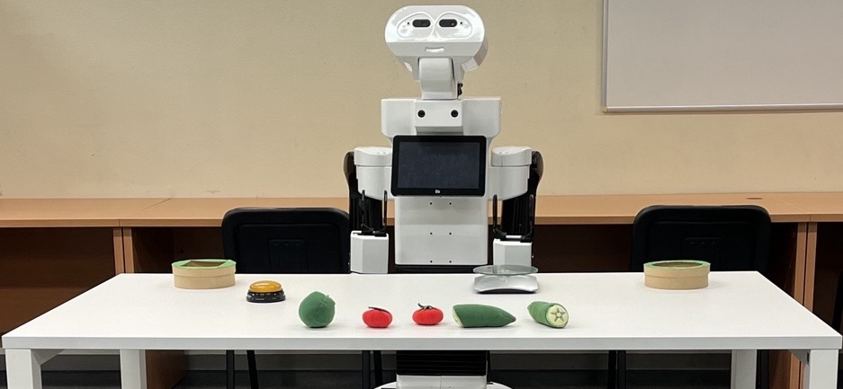

# Pump panel Experiment
(Work in progress)

Lorem ipsum dolor sit amet, consectetur adipiscing elit. Vestibulum vitae volutpat nunc, id malesuada ipsum. 

<!-- <div style="width:100%; margin:auto; text-align:center;">



*TIAGo robot experimental setup*
</div> -->

## Experiment Description

Integer erat purus, fermentum et venenatis commodo, molestie eu lorem. Nulla facilisi. Vestibulum eu facilisis dolor. Praesent ligula nisl, consectetur sed lectus eu, tempor viverra urna. Morbi congue dignissim magna, ac molestie odio. Suspendisse finibus quam at leo facilisis, in vulputate massa placerat.

### Task Overview

Donec efficitur luctus sem eget aliquet:

1. **Step 1**: 
2. **Step 2**: 
3. **Step 3**: 
4. **Step 4**: 

### Environment Setup

**Physical Elements:**


**Sensory Input:**


**Available policies**

The robot has access to 8 predefined policies:


## LLM Exploration Policy


## Execution

(Añadir los 3 experimentos)

The experiment can be executed using the e-MDB cognitive architecture framework. Source code and documentation are available online at the PILLAR-Robots project repository.

```bash
# Example execution command (adapt based on actual framework)
ros2 launch emdb_experiments fruit_classification_experiment_launch.py
```

Configuration parameters can be adjusted through the corresponding YAML configuration file to modify learning parameters, curriculum timing, and neural network architectures.